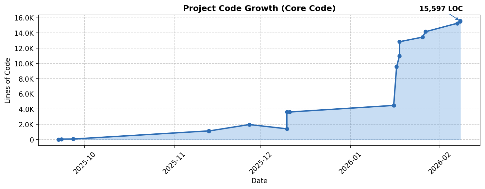

# Vision Tracker

[](https://www.python.org/)
[](https://pytorch.org/)
[](https://docs.ultralytics.com/)
[](https://www.riverbankcomputing.com/software/pyqt/)


Real-time object detection and tracking desktop application for academic research in computer vision.



## Features

- **Real-time Detection** - YOLO v11 with TensorRT acceleration
- **Custom Augmentation** - Resolution reduction, motion blur, HSV jitter for robust training
- **PID Tracking** - Smooth target following with adaptive control
- **Team Selection** - CT / ALL / T target filtering
- **Modern UI** - Custom SiliconUI framework with Fluent design
- **Multi-process** - Separate capture, detection, and overlay processes
- **User System** - SQLite authentication with session management

## Project Structure

```
app/
├── main.py                 # Application entry
├── ui/                     # UI components
│   ├── app.py             # Main window (SiliconApplication)
│   └── components/        # Pages (home, config, user, about...)
├── core/                   # Computer vision modules
│   ├── capture.py         # Screen/window capture (mss)
│   ├── detector.py        # YOLO detection
│   ├── tracker.py         # PID controller
│   ├── overlay.py         # Visual overlay rendering
│   └── tracker_manager.py # System coordinator
├── auth/                   # Authentication system
├── drivers/                # Mouse driver
├── siui/                   # SiliconUI framework
└── data/                   # Configs, avatars, database

backend/python/
├── Train/                  # Model training scripts
└── DataCollection/         # Data collection tools

frontend/python/demo/       # Standalone demo scripts
```

## Tech Stack

| Category | Technologies |
|----------|-------------|
| UI | PyQt5, SiliconUI (custom) |
| Detection | YOLO v11, TensorRT, CUDA |
| Control | PID Controller, Snap Mode |
| Capture | mss, pygetwindow, win32gui |
| Database | SQLite |

## Installation

```bash
# Clone repository
git clone https://github.com/ThermalEX/HonoursStageProject.git
cd HonoursStageProject

# Create virtual environment
python -m venv .venv
.venv\Scripts\activate  # Windows

# Install dependencies
pip install -r requirements.txt
```

## Usage

```bash
# Run desktop application
python -m app.main

# Or use entry point after installation
pip install -e .
vision-tracker
```

### Hotkeys

| Key | Function |
|-----|----------|
| `Caps Lock` | Toggle aim assist |
| `F6` | Start calibration |
| `Ctrl+Q` | Exit |

## Configuration

Settings are stored in `app/data/configs/*.json`:

```json
{
  "model_path": "path/to/model.engine",
  "operation_mode": "auto_aim_fire",
  "fov_width": 200,
  "fov_height": 200,
  "pid_kp": 0.5,
  "pid_ki": 0.03,
  "pid_kd": 0.001,
  "snap_threshold": 43,
  "snap_sensitivity": 1.0
}
```

## Training

```bash
cd backend/python/Train
python train_YOLO.py
```

### Data Augmentation

Custom augmentation pipeline designed for game scenarios:

| Augmentation | Purpose |
|--------------|---------|
| Resolution Reduce | Simulates distant/low-quality targets |
| Motion Blur | Handles fast movement scenarios |
| Gaussian Noise | Improves noise tolerance |
| Random HSV | Color variation robustness |
| Random Scale | Multi-scale detection |
| Random Flip | Horizontal symmetry |

## Academic Purpose

This project is for academic research purposes only, focusing on computer vision and object tracking algorithms. Modern game anti-cheat systems have made this method unable to control the mouse in online games - it can only be used locally for research and testing purposes.

## Requirements

- Python 3.10+
- Windows 10/11
- NVIDIA GPU (CUDA support recommended)
- 8GB+ RAM

## License

Academic use only. Not for commercial or malicious purposes.
